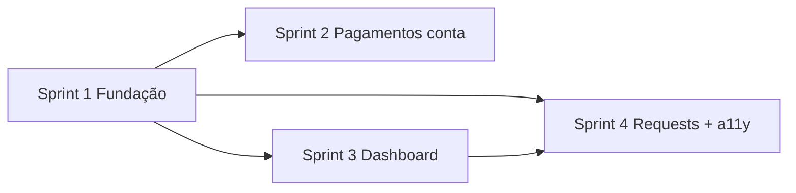

# Plano de Sprints — Melhorias UX (Imobil)

**Referência de design:** feed social (`notification_feed_item.php`, `notification-inbox-view` em `public/css/Style.css`)  
**Última revisão:** 2026-06-10  
**Estimativa:** 4 sprints (~1–2 semanas cada)  
**Estado implementação:** 2026-06-10 — sprints 1–4 concluídos; backlog em curso

---

## Política de plataforma

| Audiência | Dispositivo alvo | Abordagem UX |
|-----------|------------------|--------------|
| **Utilizador** (proprietário, solicitante, afiliado) | Mobile + desktop | Feed inbox, bottom sheets, tab bar, touch targets |
| **Admin / moderação / operações** | **PC (desktop)** | Tabelas densas, filtros largos, multi-coluna — **sem** migração para feed mobile |

Páginas admin **não entram** no âmbito de melhorias mobile. Em viewport estreito podem manter scroll horizontal ou aviso discreto; não investir em card-mode nem feeds.

### Fora de âmbito (desktop-only — não alterar para mobile)

| Rota / área | Ficheiro principal |
|-------------|-------------------|
| Disputas | `app/view/dashboard/disputes/Main.php` |
| Hub de pagamentos (admin) | `app/view/dashboard/payments/Main.php` |
| Transacções (gestão) | `app/view/dashboard/payment_transactions/Main.php` |
| Moderação de utilizadores | `app/view/dashboard/moderate_users/Main.php` |
| Revisão de documentos | `app/view/dashboard/review_documents/Main.php` |
| Moderação de imóveis | `app/view/property/moderate/Main.php` |
| KPI / auditoria / canais / métodos de pagamento (admin) | `kpi/`, `audit_log/`, `payment_methods/`, `payment_channels/` |
| Subscrições admin | `admin_subscriptions/Main.php` |

### No âmbito (utilizador — mobile-first)

| Rota / área | Estado actual |
|-------------|---------------|
| Notificações inbox / arquivo / modal sino | Feito |
| Solicitações `/requests` | Feito (refinar meta mobile) |
| Conversas `/dashboard/requestChats` | Feito |
| Histórico de pagamentos (conta) | Tabela antiga — **Sprint 2** |
| Comissões / pagamentos ao afiliado (conta) | Tabela — **Sprint 2** |
| Dashboard home `/dashboard` | Layout antigo — **Sprint 3** |
| Perfil, imóveis, favoritos, checkout subscrição | Backlog (pills em `/properties` feito) |

---

## Visão geral (revisada)

| Sprint | Foco | Impacto |
|--------|------|---------|
| [Sprint 1](#sprint-1--fundação-técnica) | Fundação técnica | DRY; base só para ecrãs de utilizador |
| [Sprint 2](#sprint-2--pagamentos-da-conta) | Pagamentos da conta | Proprietários e afiliados em mobile |
| [Sprint 3](#sprint-3--dashboard-home-e-modais) | Home + modais | Entrada do painel e documentos |
| [Sprint 4](#sprint-4--requests-tab-bar-e-a11y) | Requests + tab bar + a11y | Negociação diária e navegação |

---

## Sprint 1 — Fundação técnica

**Objetivo:** Extrair código partilhado do padrão inbox **apenas** para fluxos de utilizador. Nenhuma alteração visual em páginas admin.

### Entregáveis

1. **Helper de agrupamento temporal**
   - Novo: `src/classes/FeedGrouping.php`
   - `byRecency(array $items, string $dateField = 'created_at'): array`
   - Opcional: `withUnreadFirst(array $items, callable $unreadFn): array` (para chats)
   - Refactor sem mudança visual:
     - `app/view/dashboard/notification_inbox/Main.php`
     - `app/view/dashboard/requests/Main.php`
     - `app/view/dashboard/request_chats/Main.php`

2. **Shell de feed para utilizador**
   - Novo: `app/view/partials/user_feed_shell.php`
   - Hero `notification-inbox-hero` + panel + grupos + empty + paginação
   - **Não** usar em vistas admin

3. **Documentar política desktop admin**
   - Secção neste ficheiro (acima) + nota em comentário no topo de `user_feed_shell.php`

### Critérios de aceitação

- [ ] Três vistas de utilizador usam `FeedGrouping` sem regressão visual
- [ ] Nenhum ficheiro em `disputes/`, `payments/`, `moderate_users/`, `review_documents/` alterado
- [ ] Smoke: inbox, requests, requestChats em 375px e 1280px

### Ficheiros

```
src/classes/FeedGrouping.php
app/view/partials/user_feed_shell.php
app/view/dashboard/notification_inbox/Main.php
app/view/dashboard/requests/Main.php
app/view/dashboard/request_chats/Main.php
```

---

## Sprint 2 — Pagamentos da conta

**Objetivo:** Experiência mobile para **histórico e comissões do próprio utilizador**, não para o hub admin.

### Escopo incluído

- `app/view/dashboard/payment_history/Main.php` — histórico pessoal
- `app/view/dashboard/commission_payments/Main.php` — fluxo proprietário/afiliado (separar de secções só-admin no controller, se misturadas)

### Escopo excluído

- `payments/Main.php`, `payment_transactions/Main.php` — permanecem tabela desktop

### Entregáveis

1. **Partial** `app/view/partials/payment_transaction_feed_item.php`  
   Tipo, valor, estado (chip), referência, tempo relativo.

2. **Histórico de pagamentos** — hero inbox + feed via `user_feed_shell.php`; filtros `filter-toolbar` mantidos.

3. **Comissões da conta** — mesma linguagem visual onde a vista é de utilizador (não operador).

### Critérios de aceitação

- [x] `/dashboard/paymentHistory` consistente com `/notification/inbox` em mobile
- [x] Filtros e export (se existir) funcionais
- [x] Hub admin `/dashboard/payments` **inalterado**
- [x] `/dashboard/commissionPayments` — pendentes e histórico em feed, linguagem para utilizador

### Ficheiros

```
app/view/partials/payment_transaction_feed_item.php
app/view/dashboard/payment_history/Main.php
app/view/dashboard/commission_payments/Main.php
public/css/Style.css   (apenas classes .payment-account-feed*, não .payments-admin-view)
```

---

## Sprint 3 — Dashboard home e modais

**Objetivo:** Melhorar entrada do painel para **todos os perfis**; modais mobile nos fluxos de conta (documentos).

### Entregáveis

1. **Preview de actividade** em `app/view/dashboard/index/Main.php`
   - 3–5 notificações (`notification_feed_item.php`, `$compact = true`)
   - Opcional: 3 solicitações recentes (modo compacto)
   - Admin: mesmos cards de resumo actuais; preview opcional (notificações operacionais)

2. **Modais unificados (utilizador)**
   - CSS `.sheet-modal` (extrair do bottom sheet de notificações)
   - JS `openSheetModal` / `closeSheetModal` em `script.js`
   - Migrar `doc-modal` de resubmissão no dashboard home

### Critérios de aceitação

- [x] `/dashboard` com secção de actividade recente (notificações + pedidos)
- [x] Resubmeter documento em bottom sheet ≤768px
- [x] Sem avisos técnicos ao utilizador (ex.: “use um ecrã mais largo”)

### Ficheiros

```
app/view/dashboard/index/Main.php
public/css/Style.css
public/js/script.js
app/controller/ControllerDashboardHome.php
```

---

## Sprint 4 — Requests, tab bar e a11y

**Objetivo:** Polir fluxos de negociação (utilizador) e navegação mobile do painel.

### Entregáveis

1. **Meta simplificada em mobile** — `request_feed_item.php` + CSS  
   Mobile: estado + tempo visíveis; chips secundários no painel “Ações”.

2. **Legenda de estados** — `requests/Main.php`  
   Colapsada por defeito; sheet “Como funcionam os estados?”.

3. **Tab bar** — `dashboard_mobile_tabbar.php` + `Layout.php`  
   Badge de chat não lido em “Pedidos”; badge de notificações no “Painel” (se couber sem 6.º item).

4. **Acessibilidade (fluxos utilizador)**
   - Focus trap em sheets (notificações + `.sheet-modal`)
   - `aria-live` ao marcar notificação lida
   - Contraste `.tone-*` / `#e7f3ff`

5. **Documentação**
   - Checklist “novo ecrã utilizador” no final deste ficheiro
   - `DOCUMENTACAO_INDICE.md` já referencia este plano

### Critérios de aceitação

- [x] `/requests` legível em 375px sem excesso de badges na linha principal
- [x] Tab bar com badges de chat e/ou notificações
- [x] Smoke mobile: inbox, requests, chats, payment history, dashboard home
- [x] **Não** exigir smoke mobile em disputes, payments admin, moderate_users

**Estado:** concluído (2026-06-10).

### Ficheiros

```
app/view/partials/request_feed_item.php
app/view/dashboard/requests/Main.php
app/view/partials/dashboard_mobile_tabbar.php
app/view/Layout.php
public/css/Style.css
public/js/script.js
```

---

## Dependências



- Sprint 1 bloqueia 2, 3 e 4 (helper + shell).
- Sprints 2 e 3 podem correr em paralelo após Sprint 1.

---

## Definição de pronto (DoD)

### Ecrãs de utilizador

- [x] Testado em 375×812 e 1280px (Sprints 1–4)
- [x] CSRF e rotas preservados
- [x] Cache bust `Style.css` / `script.js` (`?v=20260610f`)

### Ecrãs admin (se tocados — ex. hint apenas)

- [ ] Testado em **1280px+**; sem regressão de tabelas
- [ ] Mobile: aceitável com scroll horizontal ou hint; **não** obrigatório feed

---

## Backlog (pós-sprint 4)

| Item | Audiência | Notas | Estado |
|------|-----------|-------|--------|
| Pills de filtros em `property/list` | Público / utilizador | Mobile | ✅ 2026-06-10 |
| `subscription_checkout` — tabela de vencimentos | Utilizador | Cards ou sheet | |
| `my_properties`, `favorites` | Utilizador | Alinhar ao feed se listas longas | ✅ Favoritos feed; my_properties hero + pills mobile |
| `afiliados/Main.php` — vista promotor | Utilizador afiliado | Feed; **não** confundir com painel admin | Hero + pills + chips ✅ |
| Polish desktop admin (espaçamento, sticky headers) | Admin | Sem mobile | |
| E2E Playwright rotas utilizador mobile | QA | inbox, requests, payment history | |

### Explicitamente cancelado (política PC admin)

- Feed em disputas, hub payments, moderate_users, review_documents, property/moderate, KPI
- CSS card-mode para tabelas admin em mobile

---

## Checklist — novo ecrã de utilizador

Ao criar listagens para proprietários/solicitantes/afiliados:

1. Hero `notification-inbox-hero` ou variante documentada
2. Panel `notification-inbox-panel` + `user_feed_shell.php`
3. Partial de item com ícone, título, meta, tempo relativo
4. Agrupamento via `FeedGrouping::byRecency()`
5. Empty state `notification-inbox-empty`
6. Paginação `notification-inbox-pagination`
7. Validar 375px
8. Se a rota for admin-only → **tabela desktop**, sem checklist mobile

---

## Como usar este plano

1. Branches: `ux/sprint-1-foundation`, `ux/sprint-2-payment-account`, etc.
2. PRs não devem incluir alterações UX mobile em ficheiros da tabela “Fora de âmbito”.
3. Demo Sprint 2–4 com dispositivo mobile real; demos admin só em desktop.
